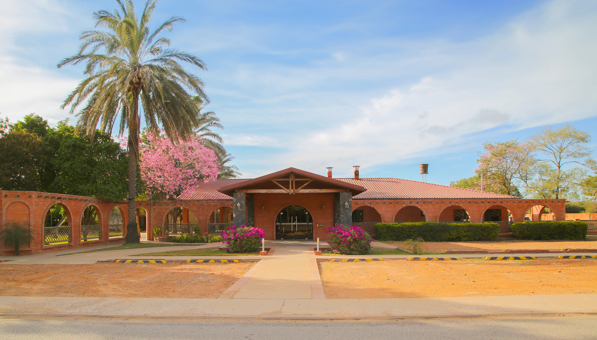

# 🏨 Hotel Boquerón - Neuland, Chaco

Sitio web oficial del Hotel Boquerón, ubicado en la Colonia Neuland, Chaco Paraguayo. Un refugio de elegancia, gastronomía de autor y hospitalidad auténtica.



## ✨ Características

- 🌍 **Multiidioma**: Español, Alemán e Inglés
- 🌓 **Temas**: Modo claro y oscuro con preferencia persistente
- 📱 **Responsive**: Diseño totalmente adaptable a móviles, tablets y desktop
- ⚡ **Rendimiento**: Imágenes optimizadas en formato WebP
- 🎨 **Diseño moderno**: Interfaz elegante con animaciones suaves
- 🍽️ **Menú dinámico**: Carta del restaurante con múltiples categorías
- 🛏️ **Galería de habitaciones**: Modal interactivo con detalles completos

## 🚀 Tecnologías

- **HTML5**: Estructura semántica y accesible
- **CSS3**: Variables CSS, Grid, Flexbox, animaciones
- **JavaScript vanilla**: Sin dependencias externas
- **Google Fonts**: Tipografías Cormorant Garamond y Montserrat

## 📂 Estructura del proyecto

```
Hotel Web/
├── Index.html          # Página principal
├── styles.css          # Estilos y temas
├── script.js          # Funcionalidad e i18n
├── .gitignore         # Archivos ignorados
└── Assets/
    ├── Logo/
    │   ├── Logo Blanco.svg
    │   ├── Logo color.svg
    │   └── Logo negro.svg
    ├── edificio-hotel.webp
    └── paisaje.webp
```

## 🎯 Secciones

1. **Hero**: Imagen destacada con información clave
2. **Experiencia**: Características del hotel y servicios
3. **Habitaciones**: Suite Boquerón, Premium Doble y Familiar
4. **Restaurante**: Menú completo con horarios
5. **Reservas**: Contacto directo
6. **Footer**: Información de contacto y enlaces

## 🌐 Idiomas soportados

- **Español (ES)**: Idioma por defecto
- **Alemán (DE)**: Para la comunidad menonita
- **Inglés (EN)**: Para turistas internacionales

## 🎨 Modos de visualización

### Modo Oscuro (por defecto)
- Paleta cálida con tonos café, dorado y crema
- Fondos oscuros con gradientes suaves
- Ideal para navegación nocturna

### Modo Claro
- Fondos claros con overlay translúcido en hero
- Alta legibilidad en todas las secciones
- Perfecto para uso diurno

## 📱 Responsive Design

El sitio está optimizado para:
- 📱 Móviles (320px - 480px)
- 📱 Móviles grandes (481px - 768px)
- 💻 Tablets (769px - 1024px)
- 🖥️ Desktop (1025px+)

## 🛠️ Instalación

```bash
# Clonar el repositorio
git clone https://github.com/jarsmypa/hotel_boqueron.git

# Navegar al directorio
cd hotel_boqueron

# Abrir en navegador
# Simplemente abre Index.html en tu navegador preferido
```

## 📞 Contacto

- **Teléfono**: 0493 240 311 / 0986 126 793
- **Email**: hotel@neuland.com.py
- **Dirección**: Av. 1 de Febrero, Colonia Neuland, Chaco - Paraguay
- **Web**: [Colonia Neuland](http://www.neuland.com.py)

## 📄 Licencia

© 2026 Hotel Boquerón. Todos los derechos reservados.

---

Desarrollado con ❤️ para el Chaco Paraguayo
